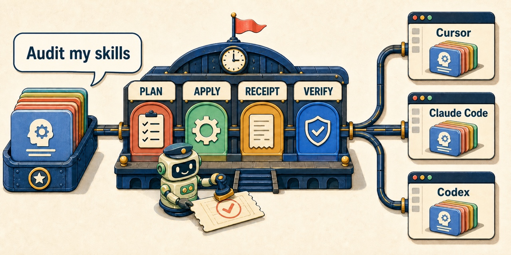

# skills-auditor

> **Bring the same AI skills to every workspace.**

`skills-auditor` is a plan-first governance skill for agentic chat environments. Ask it to inspect,
align, or integrate the skills in a workspace. It shows what would change, waits for explicit
approval, applies only the reviewed change, and checks the final state.

> **Ask once. Review the plan. Approve the change. Get a verified result.**

[](https://github.com/ERerGB/skills-auditor)

**Start here:** [Use it in chat](#use-it-in-chat) · [See what it governs](#what-it-governs) ·
[Install it](#install-and-start) · [Optional Skill Trace](#optional-skill-trace) ·
[Review the trust contract](#trust-contract) ·
[Browse the docs](#documentation)

## Use it in chat

Once the skill and CLI are available to your agent, start with an intent instead of a command
sequence:

```text
/skills-auditor

Audit the skills available to this workspace. Identify metadata issues, duplicate definitions,
platform variants, and host integration gaps. Plan only.
```

The agent inspects the environment and returns findings, proposed actions, and any evidence paths.
It does not change skill definitions or install roots during this step.

Review the proposal. When it is correct, approve exactly what should happen:

```text
Apply the reviewed plan. Do not delete anything. Verify the final state.
```

The agent applies the authorized actions, runs the closing checks, and reports what changed. If a
host does not expose slash commands, ask for the same workflow in natural language.

## What it governs

| Your goal | What skills-auditor does |
| --- | --- |
| Understand the current environment | Inventories host-visible roots, metadata, Git drift, and discovery collisions |
| Repair safe metadata problems | Proposes idempotent frontmatter repairs and waits for apply approval |
| Resolve duplicate or variant skills | Relinks byte-identical definitions; keeps differing variants visible for routing |
| Bring canonical skills to a workspace | Plans native links for Cursor, Claude Code, Codex, or an explicit custom root |
| Keep approved bytes stable during edits | Managed installations expose approved snapshots while replacement candidates remain separate |
| Recover an interrupted managed change | Records intent and step evidence for explicitly approved resume or compensation |
| Investigate a managed warning | Links persistent incidents, bounded evidence and append-only notes to resolution proof |
| Leave a checkable result | Produces plans, receipts, route traces, verification results, and optional run ledgers |
| Inspect observed skill access | Optional Skill Trace records local task, tool, and path evidence for later audit |

The default posture is conservative: inspect first, preserve differing definitions, archive before
replacement, and never infer permission to delete.

Choose [managed lifecycle](docs/managed-lifecycle.md) when you need version selection, durable
revocation and recovery. Existing live-link integrations remain compatible; migration is explicit.

## Install and start

Today the product ships as two cooperating pieces: the agent skill defines the governance behavior,
and the `skills-audit` CLI performs the local checks and approved filesystem actions.

Clone the skill and install its CLI:

```bash
git clone https://github.com/ERerGB/skills-auditor.git
cd skills-auditor
pipx install .
skills-audit --version
```

Then register the clone as `skills-auditor` through your host's normal skill directory. For a
global Codex installation:

```bash
ln -s /absolute/path/to/skills-auditor ~/.codex/skills/skills-auditor
```

Use `~/.cursor/skills` or `~/.claude/skills` for the corresponding host, or the project-scoped
`.cursor/skills`, `.claude/skills`, or `.codex/skills` directory. Keep the whole clone together:
the root [`SKILL.md`](SKILL.md) composes the sub-skills, configuration, and CLI.

After registration, return to chat and invoke `/skills-auditor`. See
[installation options](docs/install.md) if you prefer a virtual environment, Git URL install, or
no-install entry point.

### Optional Skill Trace

Skill Trace records local task, tool, and skill-path events for later audit. These events establish
observed access; they do not prove that a model followed a skill or produced a correct result.
Capture is off by default. To use it,
follow the [plugin installation and trust steps](docs/install.md#optional-skill-trace-plugin):
install the plugin, review its four handlers in Codex CLI `/hooks`, explicitly enable capture,
then verify a live task. Installing the plugin alone does not trust its hooks.

| Action | Command |
| --- | --- |
| Enable capture | `skills-audit skill-trace enable` |
| Disable capture and preserve history | `skills-audit skill-trace disable` |
| Inspect the current setting and health | `skills-audit skill-trace status` |
| Check capture before skill use | `skills-audit skill-trace check` |

These controls apply only to Skill Trace. Each skill invocation checks capture health before work;
ordinary auditing remains available when capture is off or unhealthy. A healthy check requires
recent tool-before and tool-after events from the current task and directory. See
[purpose and evidence limits](docs/skill-trace.md) or
[troubleshoot missing capture](docs/troubleshooting.md#skill-trace-captures-no-events).

## Trust contract

- **Plan first:** generic chat requests inspect and propose; they do not mutate skill definitions or
  install roots.
- **Version-bound approval:** apply occurs only after direct operator wording or an explicit apply
  configuration. That approval covers the reviewed source hashes and target state, not every future
  version; verification drift invalidates it and requires a new plan and explicit re-approval.
- **No inferred deletion:** archive and keep are supported defaults; deletion always requires
  separate, explicit wording.
- **Check the close:** integration receipts verify installed links and source payloads, reporting
  whether the version-bound approval remains valid; maintenance runs finish with another audit.
- **Preserve evidence:** failed applies retain completed actions and error details when the
  filesystem permits it.

Legacy receipt verification is a current observation: restoring the reviewed bytes can make the
same receipt valid again. Managed installations instead retain invalidation and require new
explicit approval. Their `[OK]`, `[WARN]` and `[BLOCK]` status separates approval from evidence age;
use-time preflight is an integration point, not an automatic badge or enforcement in every host.

Built-in project and global targets are available for Cursor, Claude Code, and Codex. Explicit
paths cover other host layouts.

The boundary is filesystem governance. `skills-auditor` can establish metadata conformance,
definition provenance, payload integrity, and lifecycle evidence. It does not execute a skill or
prove semantic safety, and it cannot prevent a live symlink change from being consumed between
verification runs. It does not promise identical behavior across models, credentials, tools, or
hosts.

## Documentation

If you are operating the product, start with:

| Need | Read |
| --- | --- |
| Install or run a first proof | [Getting started](docs/getting-started.md) · [Installation](docs/install.md) |
| Set up and operate optional Skill Trace | [Install and trust](docs/install.md#optional-skill-trace-plugin) · [Purpose, controls, and health](docs/skill-trace.md) |
| Find task-oriented examples | [Examples and recipes](docs/examples.md) |
| Recover from a failed run | [Troubleshooting](docs/troubleshooting.md) |
| Review the security boundary | [Security and dependency review](docs/security.md) |

If you are integrating, extending, or automating it:

| Need | Read |
| --- | --- |
| Use versioned plans, receipts, and JSON | [Integration contract](docs/integration-contract.md) |
| Manage versions, authorization and recovery | [Managed lifecycle](docs/managed-lifecycle.md) |
| Automate checks in CI | [CI and automation](docs/ci.md) |
| Inspect the agent and Python surfaces | [Skill contract and API reference](docs/skill-contract.md) |
| Maintain or compare the project | [Releasing](docs/releasing.md) · [Alternatives](docs/alternatives.md) |

Full searchable map: [atlas.fulmail.net/oss/skills-auditor](https://atlas.fulmail.net/oss/skills-auditor)

Python 3.9+ · standard-library runtime · [MIT License](LICENSE) ·
[GitHub repository](https://github.com/ERerGB/skills-auditor)
